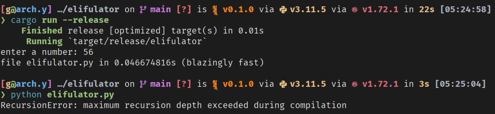

# elifulator

horrible meme code. for your own sake, don't run it.

it creates `elifulator.py`, a calculator made up out of (mostly) python `if else` statements. inspired by this picture:


## running

```bash
cargo run --release
python elifulator.py
```

## usage

just give it a number. that's how high the checks will go.

the highest i've set it to is 10000. it took 493 seconds (8 minutes) to create the python script, and was 5.4gb large, consisting of 200 million lines.

also, the script won't run if you input a number that's higher than 55 (5945 lines). so there's not much point to going further. lol

## gallery





